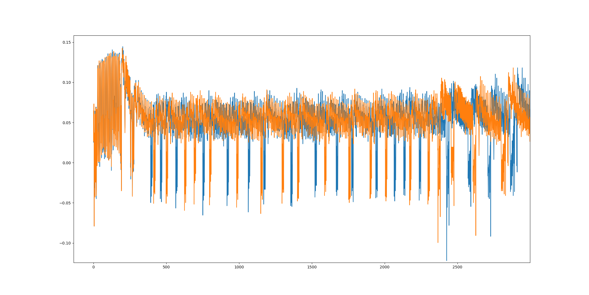
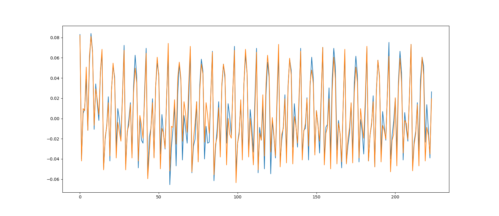

# AES with a lot of jittering

The encryption used is AES-128 with random jittering in between the subbyte function. The jittering is observable in the traces. 
To eliminate jittering, the parts of trace belongings to subbytes are extracted before performing CPA. The extraction is performed using numpy
correlate function. 

The following picture shows part of 2 traces. As random jitter are inserted during the sub bytes process, shifts are observed.

The following picture shows the extract of 2 traces.

The secret key used can be recovered using CPA attack on the extracted trace
