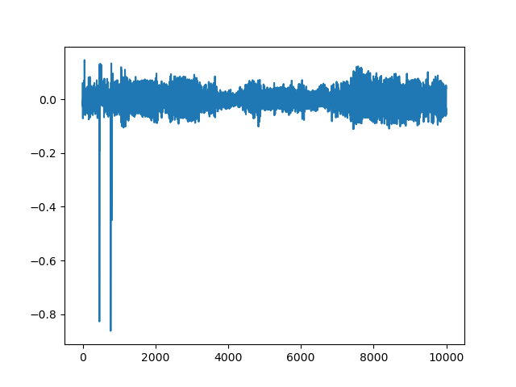

# Stagegate1

The encryption used is standard AES-128. The secret key used can be recovered using the correlation power analysis (CPA) attacks.
The CPA attacks target the output of the first sub byte function. The attack is divided into 2 steps: train and test.

**Train**

The training step train the model using the traces of known fixed key and random plaintext. 
The training model take the known plaintext, traces and the known keys processed as the input.
The purpose of the training phase is to find the points of interest (POIs), which are the points that give high correlation between 
the hamming weight of the first sub byte output and the power consumption.

The following image shows the correlation between the hamming weight of the output of the first subbyte and the power consumption. The ~500th and ~1000th sample point show signifiant high correaltion. This point is considered as the POI

**Test**

The test step takes the traces and the plaintext as inputs and predict the secret key used. 
The prediction is based on the POIs found in the train step. 
