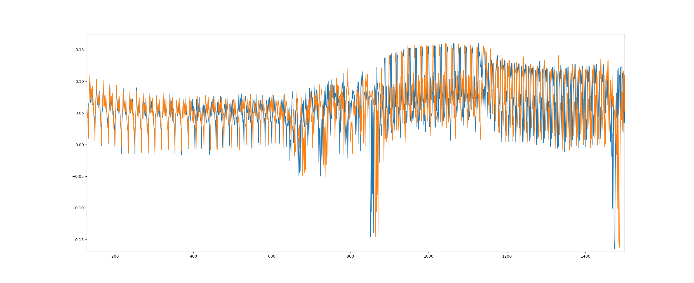
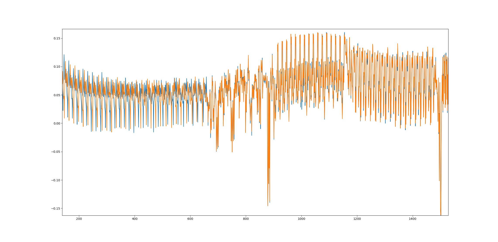

# stagegate2 writeup

The encryption used is standard AES-128 with random jittering at the begining of the encryption. 
In order to recover the secret key processed using CPA attacks, the traces have to be aligned. The trace alignment is performed using numpy correlate function. 

The following picture shows the beginning part of 2 different traces before alignment. Shift can be observed between 2 traces.

The following picture shows part of 2 traces after alignment. 2 traces appear to be synchonized after alignment.

After alignment, the secret key used can be recovered using CPA attack
